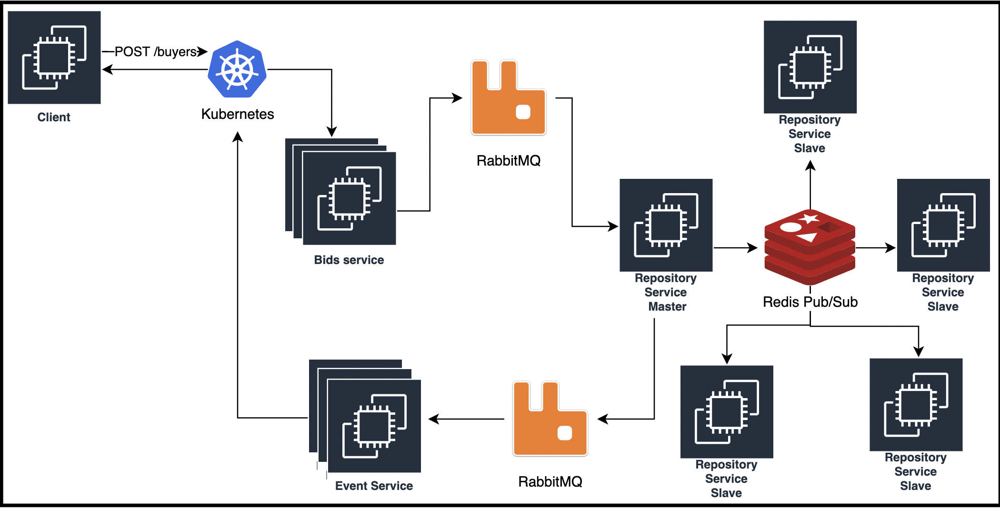

<p align="center">
  <a href="http://nestjs.com/" target="blank"></a>
</p>

[circleci-image]: https://img.shields.io/circleci/build/github/nestjs/nest/master?token=abc123def456
[circleci-url]: https://circleci.com/gh/nestjs/nest

  <p align="center">A progressive <a href="http://nodejs.org" target="_blank">Node.js</a> framework for building efficient and scalable server-side applications.</p>
    <p align="center">
<a href="https://www.npmjs.com/~nestjscore" target="_blank"></a>
<a href="https://www.npmjs.com/~nestjscore" target="_blank"></a>
<a href="https://www.npmjs.com/~nestjscore" target="_blank"></a>
<a href="https://circleci.com/gh/nestjs/nest" target="_blank"></a>
<a href="https://coveralls.io/github/nestjs/nest?branch=master" target="_blank"></a>
<a href="https://discord.gg/G7Qnnhy" target="_blank"></a>
<a href="https://opencollective.com/nest#backer" target="_blank"></a>
<a href="https://opencollective.com/nest#sponsor" target="_blank"></a>
  <a href="https://paypal.me/kamilmysliwiec" target="_blank"></a>
    <a href="https://opencollective.com/nest#sponsor"  target="_blank"></a>
  <a href="https://twitter.com/nestframework" target="_blank"></a>
</p>
  <!--[](https://opencollective.com/nest#backer)
  [](https://opencollective.com/nest#sponsor)-->

## Description

[Nest](https://github.com/nestjs/nest) framework TypeScript starter repository.

## Installation

```bash
$ npm install
```

## Running the app

```bash
# development
$ npm run start

# watch mode
$ npm run start:dev

# production mode
$ npm run start:prod
```

## Architecture



- **Caso 1: Un comprador se registra**


- **Caso 2: Un vendedor crea una subasta**

- **Caso 3: Un vendedor elimina una subasta**


- **Caso 4: Un comprador subasta un nuevo precio**


- **Caso 5: Se finaliza el plazo de la subasta**


## Endpoints
### Comprador
**POST** /bids/{id} 
> Notifica una creacion/modificacion de subasta al comprador

    {
      "price": 0,
      "duration": 3600,
      "article": {
        "name": "",
        "description": ""
      }
    }
**DELETE** /bids/{id}
> Notifica que se finalizo una subasta

    {
        "winner": {{name}},
        "price": 100
    }


### Servicio de subastas
**POST** /bids 
> El vendedor crea una subasta

    {                                      
      "tags": ["hogar", "muebles"]         
      "price": 0,                          
      "duration": 3600,                    
      "article": {                         
        "name": "",                        
        "description": ""                  
      }                                    
    }                                      

Response

    {
      "id": 1
    }
**DELETE** /bids/{{id}}
> El vendedor cancela la subasta

**POST** /buyers 
> El comprador se da de alta

    {
      "name": ""
      "ip": 0.0.0.0,
      "tags": ["hogar"]
     }

**PUT** /bids/{id} 
> El comprador oferta un nuevo precio

    {
      "price": 0,
      "ip": 0.0.0.0
    }

## Test

```bash
# unit tests
$ npm run test

# e2e tests
$ npm run test:e2e

# test coverage
$ npm run test:cov
```

## Support

Nest is an MIT-licensed open source project. It can grow thanks to the sponsors and support by the amazing backers. If you'd like to join them, please [read more here](https://docs.nestjs.com/support).

## Stay in touch

- Author - [Kamil Myśliwiec](https://kamilmysliwiec.com)
- Website - [https://nestjs.com](https://nestjs.com/)
- Twitter - [@nestframework](https://twitter.com/nestframework)

## License

Nest is [MIT licensed](LICENSE).
